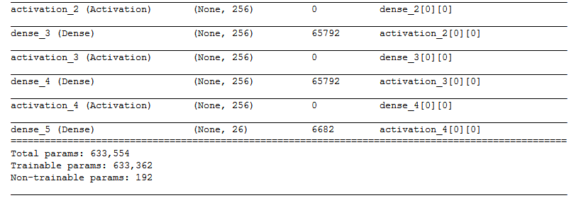

# NNFL Project Report
## Visual Question Answering

[Training.zip](https://drive.google.com/file/d/1ixhaNP2AgVLrclEJYUpohE_1PO4-Xfj0/view?usp=sharing)

Deepesh Makhijani 2015B1A80764G

Vaibhav Kulshrestha 2015B1A30760G

### Approach/Model description

We tried 3 different approaches:

##### Model with grouped answers

In this model, we grouped the possible scenarios into 6 based on the type of answers, for example colour, shape, size etc.

We made two neural networks. The first network (LSTM) would identify the group from the question. The second network would now find the answer based on the question and image. This second network comprised of 6 individual models, one for each group.

We hoped that this would improve accuracy as the model will have to choose from a smaller set of answers. But, this did not happen because the accuracy for the first network was low and each model in the second network got less samples to train on. Thus, we did not proceed ahead with this.

##### CNN+LSTM

This model used CNN to encode the image and LSTM to encode the question. These two were concatenated and then fed to a dense layer.

##### CNN+LSTM+MLP 

This model, like the previous, used CNN to encode the image, LSTM to encode question and MLP for final classification. The CNN and the LSTM were concatenated and fed into MLP. In this, the answers were one-hot encoded.

### Architecture

We tokenized 100 unique words and took maximum 40 words from each question. This is because the questions are machine generated and thus don't have much variance. This is also the reason why we didn't use a glove.

We resized images to (60,80) to keep the model size down and normalized pixel values from 0-1.

### Results

##### Model 1 loss with Conv layer of (32, (3, 3))

##### Model 1 loss with Conv layer of (24, (5, 5))

Thus we see that the model with stride 5 performs slightly better that the one with stride 3. That is why, we build upon this model by adding MLP.

##### Model 2 loss

We see that both the models achieved similar accuracies of 46%. The first model achieved it in 8 epochs while the second took only 5.

##### Model 1 architecture

##### Model 2 architecture

